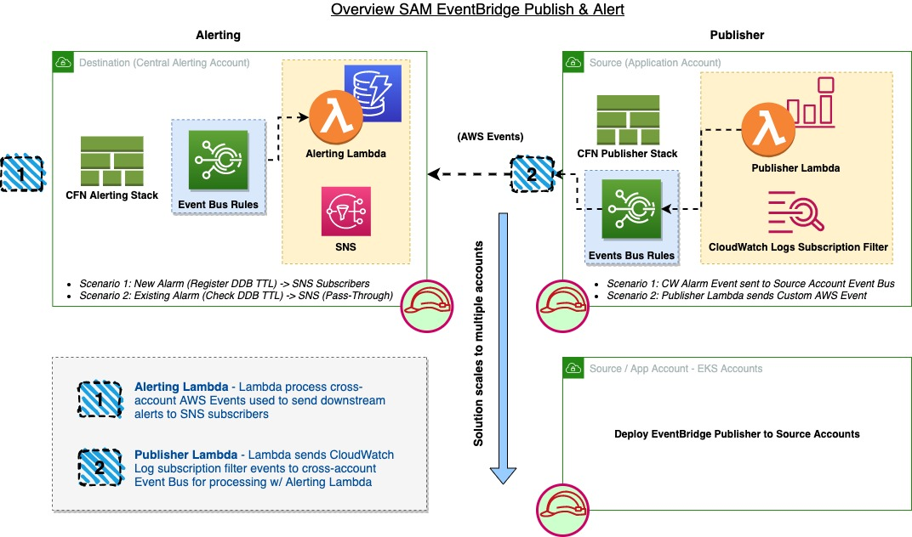

# Cross-Account EventBridge Alerting for CloudWatch & Custom Events


# sam-eventbridge-alerting

This project contains source code and supporting files for a serverless application that you can deploy with the SAM CLI. It includes the following files and folders.

- eventbridge - Code for the application's Lambda function.
- events - Invocation events that you can use to invoke the function.
- tests - Unit tests for the application code. 
- template-alerting.yaml - A template that defines the SAM Alerting application's AWS resources.
- template-publisher.yaml - A template that defines the SAM Publisher application's AWS resources.

The application uses several AWS resources, including Lambda functions and an EventBridge Rule. These resources are defined in the `template-*.yaml` file in this project. You can update the template to add AWS resources through the same deployment process that updates your application code.

If you prefer to use an integrated development environment (IDE) to build and test your application, you can use the AWS Toolkit.  
The AWS Toolkit is an open source plug-in for popular IDEs that uses the SAM CLI to build and deploy serverless applications on AWS. The AWS Toolkit also adds a simplified step-through debugging experience for Lambda function code. See the following links to get started.

* [IntelliJ](https://docs.aws.amazon.com/toolkit-for-jetbrains/latest/userguide/welcome.html)
* [PyCharm](https://docs.aws.amazon.com/toolkit-for-jetbrains/latest/userguide/welcome.html)
* [VS Code](https://docs.aws.amazon.com/toolkit-for-vscode/latest/userguide/welcome.html)
* [Visual Studio](https://docs.aws.amazon.com/toolkit-for-visual-studio/latest/user-guide/welcome.html)

## Deploy the EventBridge Alerting & Publisher CloudFormation Stacks (SAM application)

The Serverless Application Model Command Line Interface (SAM CLI) is an extension of the AWS CLI that adds functionality for building and testing Lambda applications. It uses Docker to run your functions in an Amazon Linux environment that matches Lambda. It can also emulate your application's build environment and API.

To use the SAM CLI, you need the following tools.

* SAM CLI - [Install the SAM CLI](https://docs.aws.amazon.com/serverless-application-model/latest/developerguide/serverless-sam-cli-install.html)
* [Python 3 installed](https://www.python.org/downloads/)
* Docker - [Install Docker community edition](https://hub.docker.com/search/?type=edition&offering=community)

## Alerting - Destination Account (Receives AWS Events from Source Account)

To build and deploy your application for the first time, run the following in your shell:
```bash
sam build -t template-alerting.yaml
sam deploy --guided -t template-alerting.yaml --config-env alerting --profile alerting
```

The first command will build the source of your application. The second command will package and deploy your application to AWS, with a series of prompts:

* **Stack Name**: The name of the stack to deploy to CloudFormation. This should be unique to your account and region, and a good starting point would be something matching your project name.
* **AWS Region**: The AWS region you want to deploy your app to.
* **Confirm changes before deploy**: If set to yes, any change sets will be shown to you before execution for manual review. If set to no, the AWS SAM CLI will automatically deploy application changes.
* **Allow SAM CLI IAM role creation**: Many AWS SAM templates, including this example, create AWS IAM roles required for the AWS Lambda function(s) included to access AWS services. By default, these are scoped down to minimum required permissions. To deploy an AWS CloudFormation stack which creates or modifies IAM roles, the `CAPABILITY_IAM` value for `capabilities` must be provided. If permission isn't provided through this prompt, to deploy this example you must explicitly pass `--capabilities CAPABILITY_IAM` to the `sam deploy` command.
* **Save arguments to samconfig.toml**: If set to yes, your choices will be saved to a configuration file inside the project, so that in the future you can just re-run `sam deploy` without parameters to deploy changes to your application.

For successive deployments use the created `samconfig.toml` config environment:
```
sam build -t template-alerting.yaml
sam deploy -t template-alerting.yaml --config-env alerting --no-fail-on-empty-changeset --profile alerting
# Append to command `--no-confirm-changeset` if you choose to auto-approve cloudformation stack change sets
```

## Publisher - Source Account (Sends AWS Events to Destination Account)

To build and deploy your application for the first time, run the following in your shell:
```bash
sam build -t template-publisher.yaml
sam deploy --guided -t template-publisher.yaml --config-env publisher --profile publisher
# Append to command `--no-confirm-changeset` if you choose to auto-approve cloudformation stack change sets
```

The first command will build the source of your application. The second command will package and deploy your application to AWS, with a series of prompts:

* **Stack Name**: The name of the stack to deploy to CloudFormation. This should be unique to your account and region, and a good starting point would be something matching your project name.
* **AWS Region**: The AWS region you want to deploy your app to.
* **Confirm changes before deploy**: If set to yes, any change sets will be shown to you before execution for manual review. If set to no, the AWS SAM CLI will automatically deploy application changes.
* **Allow SAM CLI IAM role creation**: Many AWS SAM templates, including this example, create AWS IAM roles required for the AWS Lambda function(s) included to access AWS services. By default, these are scoped down to minimum required permissions. To deploy an AWS CloudFormation stack which creates or modifies IAM roles, the `CAPABILITY_IAM` value for `capabilities` must be provided. If permission isn't provided through this prompt, to deploy this example you must explicitly pass `--capabilities CAPABILITY_IAM` to the `sam deploy` command.
* **Save arguments to samconfig.toml**: If set to yes, your choices will be saved to a configuration file inside the project, so that in the future you can just re-run `sam deploy` without parameters to deploy changes to your application.

For successive deployments use the created `samconfig.toml` config environment:
```
sam build -t template-publisher.yaml
sam deploy -t template-publisher.yaml --config-env publisher --no-fail-on-empty-changeset --profile publisher
# Append to command `--no-confirm-changeset` if you choose to auto-approve cloudformation stack change sets
```


## Use the SAM CLI to build and test locally

Build your application with the `sam build` command.

```bash
sam build
```

The SAM CLI installs dependencies defined in `eventbridge/requirements.txt`, creates a deployment package, and saves it in the `.aws-sam/build` folder.

Test a single function by invoking it directly with a test event. An event is a JSON document that represents the input that the function receives from the event source. Test events are included in the `events` folder in this project.

Run functions locally and invoke them with the `sam local invoke` command.

### Alerting Lambda Function w/ Test Event
```bash
# Alerting - Destination Account
sam local invoke EventBridgeAlertingFunction -t template-alerting.yaml --event events/alerting-event.json
```

Don't forget to update the event.json detail with the fields you want to set from your schema.aws.cloudwatch.cloudwatchalarmstatechange.CloudWatchAlarmStateChange object

```yaml
      Events:
        CloudWatchAlarmEvent:
          Type: CloudWatchEvent # More info about CloudWatchEvent Event Source: https://github.com/awslabs/serverless-application-model/blob/master/versions/2016-10-31.md#cloudwatchevent
          Properties:
            EventBusName: EventBus-for-CloudWatchEvents
            Pattern:
              source:
                - aws.cloudwatch
              detail-type:
                - CloudWatch Alarm State Change
        CustomEvent:
          Type: CloudWatchEvent
          Properties:
            EventBusName: EventBus-for-CustomEvents
            Pattern:
              source:
                - "customevent"
```

### Publisher Lambda Function w/ Test Event
```bash
# Publisher - Source Account
sam local invoke EventBridgePublisherFunction -t template-publisher.yaml --event events/publisher-event.json
```

## Add a resource to your application
The application template uses AWS Serverless Application Model (AWS SAM) to define application resources. AWS SAM is an extension of AWS CloudFormation with a simpler syntax for configuring common serverless application resources such as functions, triggers, and APIs. For resources not included in [the SAM specification](https://github.com/awslabs/serverless-application-model/blob/master/versions/2016-10-31.md), you can use standard [AWS CloudFormation](https://docs.aws.amazon.com/AWSCloudFormation/latest/UserGuide/aws-template-resource-type-ref.html) resource types.

## Fetch, tail, and filter Lambda function logs

To simplify troubleshooting, SAM CLI has a command called `sam logs`. `sam logs` lets you fetch logs generated by your deployed Lambda function from the command line. In addition to printing the logs on the terminal, this command has several nifty features to help you quickly find the bug.

`NOTE`: This command works for all AWS Lambda functions; not just the ones you deploy using SAM.

### Alerting Lambda CloudWatch Logs
```bash
sam logs -n EventBridgeAlertingFunction --stack-name sam-eventbridge-alerting --tail --profile alerting
```

### Publisher Lambda CloudWatch Logs
```bash
sam logs -n EventBridgePublisherFunction --stack-name sam-eventbridge-publisher --tail --profile publisher
```

You can find more information and examples about filtering Lambda function logs in the [SAM CLI Documentation](https://docs.aws.amazon.com/serverless-application-model/latest/developerguide/serverless-sam-cli-logging.html).

## Unit tests

Tests are defined in the `tests` folder in this project. Use PIP to install the [pytest](https://docs.pytest.org/en/latest/) and run unit tests.

```bash
pip install pytest pytest-mock --user
python -m pytest tests/ -v
```

## Cleanup

To delete the sample application that you created, use the AWS CLI. Assuming you used your project name for the stack name, you can run the following:

```bash
aws cloudformation delete-stack --stack-name sam-eventbridge-alerting --profile alerting
aws cloudformation delete-stack --stack-name sam-eventbridge-publisher --profile publisher
```


## Resources

See the [AWS SAM developer guide](https://docs.aws.amazon.com/serverless-application-model/latest/developerguide/what-is-sam.html) for an introduction to SAM specification, the SAM CLI, and serverless application concepts.

Next, you can use AWS Serverless Application Repository to deploy ready to use Apps that go beyond hello world samples and learn how authors developed their applications: [AWS Serverless Application Repository main page](https://aws.amazon.com/serverless/serverlessrepo/)

## Security

See [CONTRIBUTING](CONTRIBUTING.md#security-issue-notifications) for more information.

## License

This library is licensed under the MIT-0 License. See the LICENSE file.